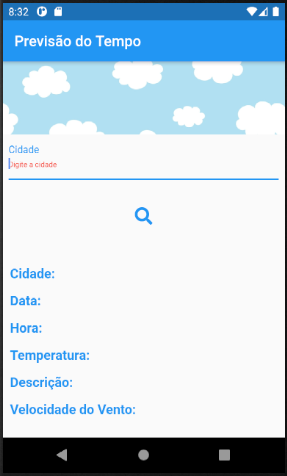
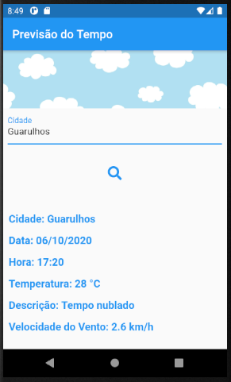

# Previsão do Tempo

Aplicativo desenvolvido para avaliação final do curso

O app faz o consumo da API da [HG Brasil](https://hgbrasil.com/status/weather), retornando informações sobre previsão do tempo ao passar nomes das cidades brasileiras.

 

